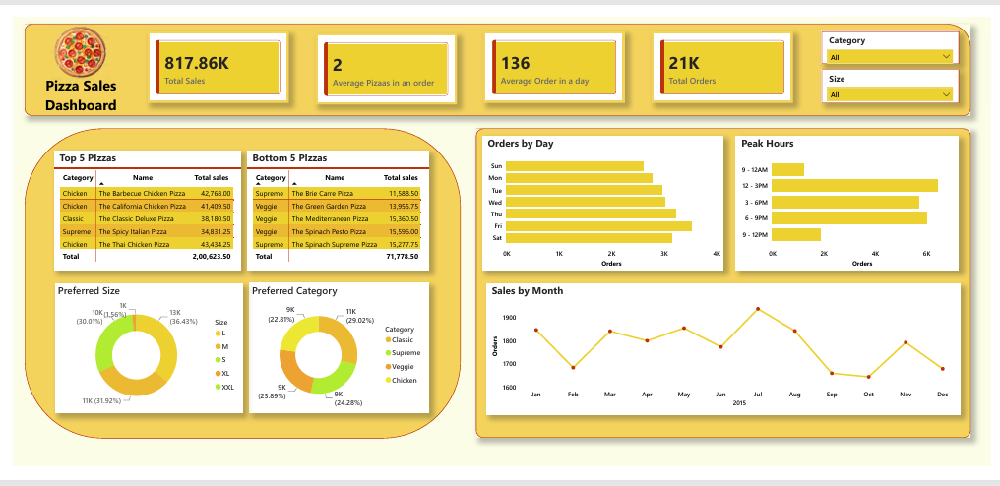

# 🍕 Pizza Sales Analysis | SQL & Power BI Dashboard

## 📌 Project Overview

This project analyzes pizza sales data using SQL and Power BI to uncover business insights, customer preferences, sales trends, and operational performance.

The project began with SQL-based data analysis and was extended into an interactive Power BI dashboard for dynamic business reporting and visualization.

---

## 🛠 Tools Used

* SQL
* Power BI
* Excel / CSV
* GitHub

---

## 📂 Dataset Files

* orders.csv
* order_details.csv
* pizzas.csv
* pizza_types.csv

---

## 🔍 SQL Analysis

The SQL phase focused on answering key business questions such as:

### Revenue Analysis

* Total Revenue Generated
* Average Order Value

### Order Analysis

* Total Orders
* Average Orders Per Day
* Peak Ordering Hours

### Product Analysis

* Most Ordered Pizza Types
* Least Ordered Pizza Types
* Revenue by Pizza Category
* Revenue by Pizza Size

### Time Analysis

* Orders by Day of Week
* Monthly Sales Trends

---

## 📊 Power BI Dashboard

An interactive dashboard was developed to visualize and explore pizza sales performance.

### Dashboard KPIs

* Total Revenue
* Total Orders
* Average Orders Per Day
* Average Pizzas Per Order

### Dashboard Features

* Sales by Month
* Peak Hours Analysis
* Orders by Day
* Sales by Pizza Category
* Sales by Pizza Size
* Top 5 Best-Selling Pizzas
* Bottom 5 Least-Selling Pizzas
* Interactive Slicers

---

### Power BI Dashboard  Preview

---

## 🎥 Dashboard Demo

Interactive dashboard walkthrough video included in:

10_video/Dashboard_Demo.mp4
---

## 📁 Repository Contents

### SQL Files

* 02_pizza_sales_project_sql.sql

### Documentation

* 03_Pizza_Sales_SQL_Analysis.pdf
* 04_Pizza_Sales_SQL_Analysis.pptx

### Dataset

* 05_orders.csv
* 06_order_details.csv
* 07_pizzas.csv
* 08_pizza_types.csv

### Screenshots
09_screenshots/01_...
09_screenshots/02_...
09_screenshots/03_...
09_screenshots/04_...
09_screenshots/05_...
09_screenshots/06_PowerBI_Dashboard.png

### Dashboard Demo
10_video/Dashboard_Demo.mp4

### Power BI Dashboard
11_Pizza_Sales_Dashboard.pbix

---

## 💡 Key Business Insights

* Weekends generate the highest order volume.
* Lunch and evening hours are peak sales periods.
* Large pizzas are the most preferred size.
* Certain pizza categories contribute significantly more revenue.
* Top-performing pizzas account for a large share of overall sales.

---

## 👨‍💻 Author

Ashmit Gupta

Aspiring Business & Data Analyst | SQL | Power BI | Excel
